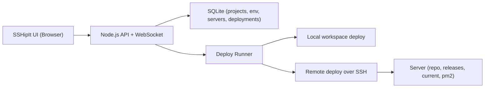

<h1 align="center">🚀 SSHipIt</h1>
<p align="center">
  <b>Self-hosted CI/CD over SSH for Node.js, Next.js, and React apps.</b><br/>
  Built for developers who want production control without sharing server access.
</p>

<p align="center">
  <a href="https://github.com/radhakishan404/sshipit/stargazers"></a>
  <a href="https://github.com/radhakishan404/sshipit/network/members"></a>
  <a href="https://github.com/radhakishan404/sshipit/issues"></a>
  <a href="https://github.com/radhakishan404/sshipit/blob/main/LICENSE"></a>
</p>

<p align="center">
  
  
  
  
  
  
</p>

---

## 😅 Why I Built This

I was doing deployments like this:

`ssh -> git pull -> npm install -> build -> migrate -> pm2 restart -> repeat`

Across multiple servers. Every day.

So I built **SSHipIt**:
- No GitHub Actions dependency
- No sharing production server with third-party CI
- No one-env-key-at-a-time UI pain
- Just clean, local-first, SSH-native deployments

If this saves your time, star it and share it.

## ✨ What It Does

- 📦 Project management for Node.js, Next.js, React
- 🖥️ Reusable SSH servers across projects
- 🔐 Encrypted server credentials (AES-256-GCM at rest)
- ⚙️ Smart stack defaults (install/build/start/restart)
- 🌱 Bulk `.env` editing for production
- 🚚 Manual deploy + one-click redeploy
- 📜 Live log streaming over WebSocket
- 🧭 Deployment history with filtering + cancel/delete
- 🧱 Release folders + `current` symlink strategy
- 🧪 Migration support (Prisma / Sequelize / Knex / TypeORM)

## 🧠 Architecture



## ⚡ Quick Start (60 seconds)

```bash
git clone https://github.com/radhakishan404/sshipit.git
cd sshipit
npm install
cp .env.example .env
npm start
```

Open: `http://localhost:3000`

Required `.env` keys:
- `PORT`
- `DATABASE_PATH`
- `WORKSPACE_ROOT`
- `KEEP_RELEASES`
- `ENCRYPTION_KEY` (set a long random value in production)

## 🛠️ First Deployment

1. Create a project
2. Select framework and click smart defaults
3. Paste production env in bulk
4. Add or attach an SSH server
5. Test connection
6. Select target server
7. Click `Deploy Now`
8. Follow live logs

## 🧩 Default Stack Behavior

| Stack | Install | Build | Restart |
|---|---|---|---|
| Node.js | `npm ci \|\| npm install` | optional | PM2 restart/start fallback |
| Next.js | `npm ci \|\| npm install` | `npm run build` | PM2 restart/start fallback |
| React | `npm ci \|\| npm install` | `npm run build` | usually nginx reload |

You can override all commands per project.

## 🔌 API + WebSocket

Core APIs:
- `GET /api/projects`
- `POST /api/projects`
- `PUT /api/projects/:id`
- `DELETE /api/projects/:id`
- `GET /api/projects/:id/env`
- `POST /api/projects/:id/env/bulk`
- `GET /api/projects/:id/servers`
- `POST /api/projects/:id/deploy`
- `GET /api/projects/:id/deployments`
- `POST /api/deployments/:id/redeploy`
- `POST /api/deployments/:id/cancel`
- `DELETE /api/deployments/:id`

WebSocket:
- `ws://localhost:3000/ws`

## 📚 Dependency Map

| Dependency | Use |
|---|---|
| `express` | HTTP API |
| `ws` | Live logs/events over WebSocket |
| `better-sqlite3` | Local metadata DB |
| `ssh2` | SSH execution and remote deploy |
| `dotenv` | Runtime env loading |
| `zod` | Request validation |
| `uuid` | IDs |
| `cors`, `morgan` | API support + logs |

## 🗺️ Roadmap (PRs Welcome)

- Git webhook auto-deploy (GitHub/GitLab/Bitbucket)
- Build/test quality gates
- Health-check gate before success
- One-click rollback
- Blue/green and canary rollout options
- Secret backends (Vault, SSM)
- Slack/Discord/email notifications
- Multi-user auth + RBAC
- Docker/Compose mode
- Kubernetes target adapter
- Deployment analytics dashboard

If you want to build one, open a PR.

## 📣 Want Users? Read This

A practical growth plan is here:
- [`DISCOVERABILITY_PLAN.md`](./DISCOVERABILITY_PLAN.md)

It includes:
- launch-week checklist
- where to post
- post templates (X/LinkedIn/Reddit/dev.to)
- repeatable content strategy for stars + users

## 🤝 Contributing

- Read [`CONTRIBUTING.md`](./CONTRIBUTING.md)
- Use issue templates in `.github/ISSUE_TEMPLATE`
- Keep PRs focused and include logs/screenshots for deploy/UI changes

## 🔐 Security

Please read [`SECURITY.md`](./SECURITY.md) for responsible disclosure.

## 📄 License

MIT - see [`LICENSE`](./LICENSE).

